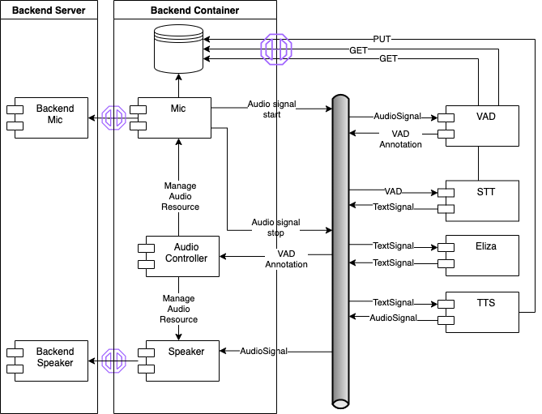

# cltl-leolani-app

Leolani implementation using the combot framework.

This application also serves as a blue-print for applications in the combot framework.

## Application Architecture

### Components

The application is composed of the following components:

- Backend Server
- Backend Container
- Voice Activity Detection (VAD)
- Automatic Speech Recognition (ASR)
- Leolani module
- Text To Speech (TTS)
- Chat UI

You will find more details on the components on the
dedicated [README](README-components.md).

### Events

The event payploads used to communicate between the individual modules follow the
[EMISSOR](https://github.com/leolani/EMISSOR.git) framework. To be continued..

## Application Runtimes

The application is setup for multiple runtime systems where it can be executed.

### Local Python application

The simplest is a local Python installation. This uses Python packages built for each module of the application
and has a main application script that configures and starts the modules from Python code.

The advantage is that communication between the modules can happen directly within the application, without the
need to setup external infrastructure components, as e.g. a messaging bus. Also, debugging of the application
can be easier, as everything run in a single process.

The disadvantage is, that this limits the application to first, use modules that are written in Python, and second,
all modules must have compatible requirements (Python version, package versions, hardware requirements, etc.).
As much as the latter is desirable, it is not always possible to fulfill.

##### Setup

The local Python application is setup in the `py-app/` folder and has the following structure:

    py-app
    ├── app.py
    ├── requirements.txt
    ├── config
    │   ├── default.config
    │   └── logging.config
    └── storage
        ├── audio
        └── video

The entry point of the application is the `app.py` script and from the `py-app/` directory after running `make build`
from the [leolani-mmai-parent](https://github.com/leolani/leolani-mmai-parent) it can be run via

    source venv/bin/activate
    python app.py

The Python application provides a [Chat UI](http://localhost:8000/chatui/static/chat.html)
and [monitoring](http://localhost:8000/monitoring/static/monitoring.html) pages through a web browser.

### Containerized application

Please look at the dedicated [README](README-docker.md) for instructions on
how to run the Docker.

## Development

For the development workflow see the [cltl-combot](https://github.com/leolani/cltl-combot) project.
