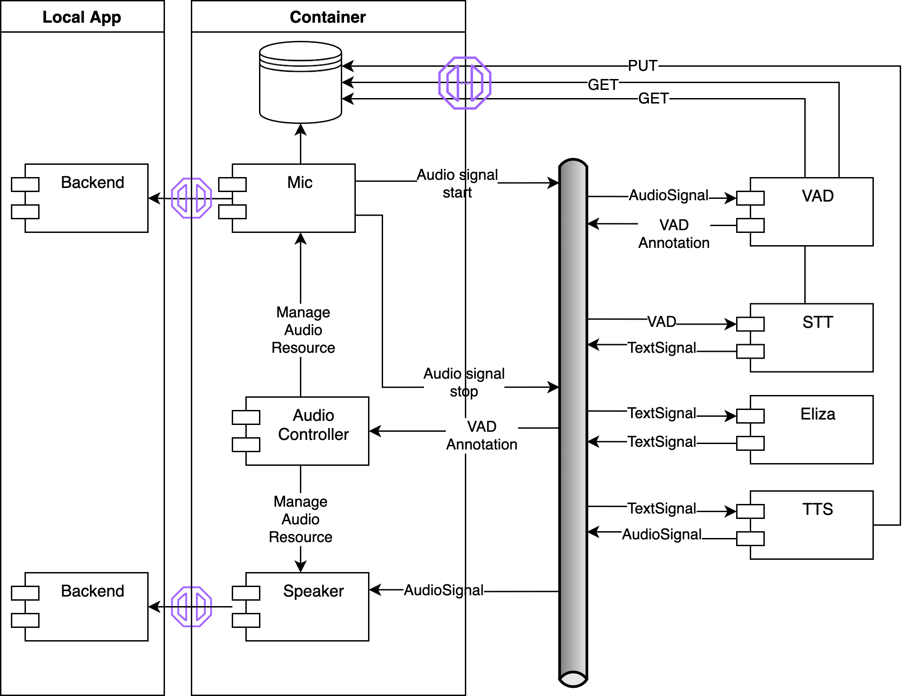

# cltl-leolani-app

Eliza implementation using the combot framework.

This application also serves as a blue-print for applications in the combot framework.

## Application Architecture

### Components

The application is composed of the following components:

#### Backend Server

The Backend Server is a standalone application that provides a REST API with the basic raw signals.

#### Backend Container

The Backend Container connects to the backend server to retrieve raw signals and processes them to
make them available in the application. This involves:
* Managing access to the signal resources (e.g. mute mic while speaking).
* Store raw signal data.
* Publish events for the incoming signals, pointing to the storage location where the raw data can be retrieved.
* Subscribe to events that result in outgoing signals and send them to the backend server.

#### Voice Activity Detection (VAD)

Subscribes to audio signal events and detects voice activity in the audio data. For detected voice activity,
an event with the respective Mention on the audio signal is published.

#### Automatic Speech Recognition (ASR)

Subscribes to voice activity events and transcribes audio data referenced in the voice activity annotation
to text. For the transcribed text, a text signal event is published, referencing the respective segment in the
AudioSignal.

#### Eliza module

Subscribes to text signals where the robot is not the speaker, processes the text and publishes a new text signal
with a response.

#### Text To Speech (TTS)

Subscribes to text signals where the robot is the speaker, and converts the text to an audio signal.

#### Chat UI

Subscribes to text signals and publishes text signals from user input. 

### Events

The event payploads used to communicate between the individual modules follow the
[EMISSOR](https://github.com/leolani/EMISSOR.git) framework. To be continued..

## Application Runtimes

The application is setup for multiple runtime systems where it can be executed.

### Local Python application

The simplest is a local Python installation. This uses Python packages built for each module of the application
and has a main application script that configures and starts the modules from Python code.

The advantage is that communication between the modules can happen directly within the application, without the
need to setup external infrastructure components, as e.g. a messaging bus. Also, debugging of the application
can be easier, as everything run in a single process.

The disadvantage is, that this limits the application to first, use modules that are written in Python, and second,
all modules must have compatible requirements (Python version, package versions, hardware requirements, etc.).
As much as the latter is desirable, it is not always possible to fulfill.

##### Setup

The local Python application is setup in the `py-app/` folder and has the following structure:

    py-app
    ├── app.py
    ├── requirements.txt
    ├── config
    │   ├── default.config
    │   └── logging.config
    └── storage
        ├── audio
        └── video

The entry point of the application is the `app.py` script and from the `py-app/` directory after running `make build`
from the [eliza-parent](https://github.com/leolani/eliza-parent) it can be run via

    source venv/bin/activate
    python app.py

The Python application provides the Chat UI at [http://localhost:8000/chatui/static/chat.html]().

### Containerized application

Alternatively to the local application, modules can be run in a containerized runtime system. In this setup
each (or a subset of) module(s) used in the application runs in a separate containerized runtime systems that
provides the requirements needed by the module. This provides full separation between the modules in terms of
software and hardware requirements, as well as isolation of their runtime state. In exchange this requires
additional infrastructure to enable the communication between the modules, as for instance a messaging bus,
resource management, container orchestration etc. In exchange this can be harder to setup and to debug, as
each module and the communication between them has to be inspected separately.

Container management can be done different tools. The next sections describe such setups. Also
see the [Docker documentation](https://docs.docker.com/get-started/orchestration/).

#### Docker compose parent app application

The `docker-parent-app/` directory provides a docker-compose setup to run a dockerized version of the local Python
application provided in `py-app/`.

* It is recommended to create a virtual environment

      python -m venv venv

  and activate it with

      source venv/bin/activate

  on Linux/OS X or for Windows in cmd.exe

      C:\> <venv>\Scripts\activate.bat

  or in a PowerShell

      C:\> <venv>\Scripts\Activate.ps1

* Install the backend including the `[host]` dependencies:

      pip install cltl.backend[host]==0.0.dev5

* Run the backend server on the local machine, on Linux/OS X with

      ./venv/bin/leoserv --channels 1 --port 8080 --resolution VGA

  The parameters should match the configured values in `py-app/config/default.comfig` and `docker-parent-app/config/`.

* Start GraphDB on your local machine.

* To use Google Cloud services for speech recognition,setup that up a project as described on their [homepage](https://cloud.google.com/speech-to-text/docs/before-you-begin).
  Copy the `google_cloud_key.json` obtained there into the `docker-parent-app/credentials/` folder.

* To use a local speech recognition implementation, in the `docker-parent-app/config` folder create a
  file with the name `cltl.asr` containing the line

      implementation: wav2vec

  and a file called `cltl.asr.wav2vec` with content

      model: jonatasgrosman/wav2vec2-large-xlsr-53-english

* Start the docker-compose application from `docker-parent-app/` with

      docker compose up

  For more information on docker compose see the [documentation](https://docs.docker.com/compose/).

To build the Docker image from scratch, from the Leolani parent directory run

    docker build -t <MY_IMAGE_NAME> .

and replace the `leolani` image in `docker-parent-app/docker-compose.yml` with your tag name.

#### Docker compose app application

Docker provides Docker compose and Docker swarm as a tool to orchestrate applications with multiple containers.

#### Kubernetes application

A widely used tool to run containerized applications is [Kubernetes](https://kubernetes.io).

## Development

For the development workflow see the [cltl-combot](https://github.com/leolani/cltl-combot) project.